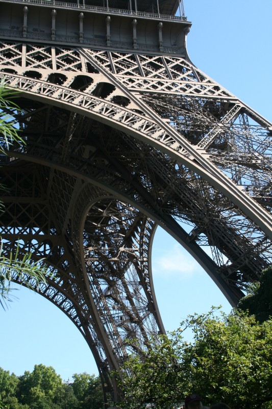

## Project Overview

Welcome to the Convolutional Neural Networks (CNN) project!  
In this project, we build a pipeline to process real-world, user-supplied images and to put the model into an app.  
Given an image, the app will predict the most likely locations where the image was taken.

### Example:  
#### Top predictions:
- Eiffel_Tower (prob: 0.81)
- Sydney_Harbour_Bridge (prob: 0.19)


### Why We're Here

Photo sharing and photo storage services like to have location data for each photo that is uploaded. With the location
data, these services can build advanced features, such as automatic suggestion of relevant tags or automatic photo
organization, which help provide a compelling user experience. Although a photo's location can often be obtained by
looking at the photo's metadata, many photos uploaded to these services will not have location metadata available. This
can happen when, for example, the camera capturing the picture does not have GPS or if a photo's metadata is scrubbed
due to privacy concerns.

If no location metadata for an image is available, one way to infer the location is to detect and classify a discernable
landmark in the image. Given the large number of landmarks across the world and the immense volume of images that are
uploaded to photo sharing services, using human judgement to classify these landmarks would not be feasible.

In this project, we are taking the first steps towards addressing this problem by building a CNN-powered app to
automatically predict the location of the image based on any landmarks depicted in the image. The app can accept any
user-supplied image as input and suggest the top k most relevant landmarks from 50 possible landmarks from across the
world.

## Project Instructions

You can try solving it on your own from the links provided below.
```
git clone https://github.com/udacity/cd1821-CNN-project-starter.git
cd cd1821-CNN-project-starter
```
For my solution, you can check the attached notebooks & src files.  
We take two approaches to solve the problem:
1. Using Transfer Learning
2. Using CNN from scratch

Once we are done, we build an app for a simple interface.

## Dataset Info

The landmark images are a subset of the Google Landmarks Dataset v2.
